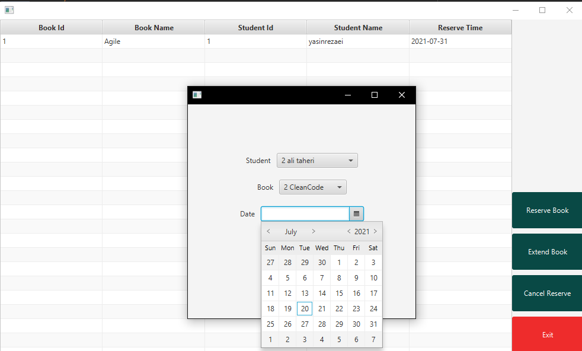

# AdvanceProgramming-Project

>Final Project Of Advance Programming [Dr.Taheri](https://scholar.google.com/citations?hl=en&user=67GnXEsAAAAJ) - Spring 2021

>University Library System
# Features
* Add Students
* Add Books
* Reserve Books For Specific Time
* Extend Books Reservation

# Save Strategies
* Fix Rec Fix Str Adaptor
* Fix Rec Dyn Str Adaptor
* Dyn Rec Fix Str Adaptor
* Dyn Rec Dyn Str Adaptor

